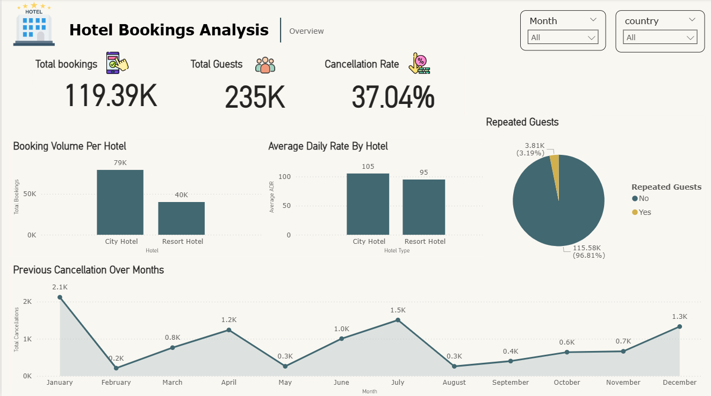

# hotel-reservation-analysis
Hotel reservation analysis project showcasing KPI analysis, booking trends, and cancellation insights using Power BI.

Project Overview

Analyzed 50K+ hotel reservation records to understand booking behavior, cancellations, and occupancy trends.
The dashboard supports pricing and operational decisions by identifying demand patterns and high-cancellation segments.

🔑 Key KPIs

Occupancy Rate

Cancellation Percentage

Average Daily Rate (ADR)

Revenue Rate

📷 Dashboard Preview

🏨 Hotel Booking Overview Dashboard

📊 Booking & Cancellation Analysis Dashboard

🧠 Insights Generated

City hotels have higher booking volume but also higher cancellation rates

Online Travel Agents contribute maximum bookings

Peak cancellations observed in specific months indicating seasonal behavior

🛠 Tech Stack

MySQL – Data cleaning & KPI calculations

Power BI – Dashboard & visualization

Excel – Data preprocessing
